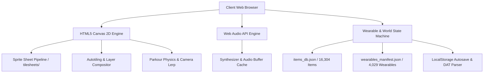

# 🌐 Growtopia Explorer & World Planner Studio

<div align="center">


**A high-performance, feature-rich web suite for Growtopia asset exploration, avatar set planning, and 2D world map building with live physics simulation.**

[](#tech-stack)
[](#tech-stack)
[](#tech-stack)
[](#testing)
[](https://vercel.com)
[](#features)

[✨ Live Features](#-key-features) • [🚀 Quick Start](#-quick-start--local-development) • [🛠️ Tech Stack](#%EF%B8%8F-technology-stack--architecture) • [📖 Documentation](#-project-structure)

</div>

---

## 🌟 Overview

**Growtopia Explorer** is an all-in-one web-based workstation crafted for Growtopia creators, world designers, and pixel artists. It features a complete database of **16,304 items**, interactive sprite extraction, a full 3-pane **Avatar Set Planner Studio** with real-time sequence animation playback, and a full-fledged **2D World Planner** equipped with authentic autotiling connections, cross-compatible `.dat` map parsing, and a live **Parkour Physics Simulator with Moderator Noclip Mode**.

Built with **100% Vanilla JavaScript** and native web APIs (HTML5 Canvas 2D, Web Audio API), the entire application runs with zero framework overhead, delivering instant startup times and silky-smooth **60 FPS** rendering.

---

## ✨ Key Features

### 1. 🔍 Item Sprite & Asset Explorer
- **Complete Item Database**: Comprehensive library of **16,304+ items** extracted directly from official Proton `items.dat` v26 and `.rttex` tilesheets.
- **Fast Fuzzy Search & Filtering**: Instant real-time search by item name, numeric ID, action type code, and categorized pills.
- **Interactive Item Modal**: Click on any item to view high-resolution 4× pixel-perfect sprite previews, base grid coordinates, and metadata.
- **Animation Sequence Previewer**: Play animated item frames in real-time with customizable frame counts and playback speeds.
- **One-Click Exporters**: Export single PNG sprites, convert animations directly into **Animated GIF**, or extract all individual frame sequences in PNG.

---

### 2. 🧍 GT Set Planner / Avatar Studio
- **3-Pane Studio Layout**:
  1. **Wearable Inventory**: Over **4,029 categorized wearables** (Hats, Shirts, Pants, Shoes, Wings, Face, Hand items, Artifacts, etc.) with search, slot tabs, and infinite scroll.
  2. **Live 384×384 Character Canvas**: Real-time multi-layered character composite with precise depth ordering, custom skin tone tinting (Tan, Light Tan, White, Blue, Dark, etc.), and facial expressions (Smile, Mad, OMG, Wink, Derp).
  3. **Layer Hierarchy & Offset Fine-Tuner**: Nudge wearable offsets on X/Y axes pixel-by-pixel with live preview updates.
- **Animated Sequence Playback**: Wearable items with multi-frame animations (e.g., fluttering wings, glowing effects) animate continuously in real-time on the avatar canvas with configurable millisecond interval timing.
- **Multi-Format Export Suite**:
  - 💾 **Single PNG (1x - 4x)**: High-resolution raster export with transparent background.
  - 🗜️ **Layered ZIP Archive**: Exports isolated layer PNGs and metadata manifest for graphic designers.
  - 🎞️ **Animated Sequence GIF**: Exports full multi-frame avatar GIF loops.

---

### 3. 🌍 GT World Planner & Map Builder
- **2D Tile Canvas Engine**: Build, paint, and design Growtopia worlds on interactive canvas with smooth mouse wheel zooming and panning.
- **Autotiling & Smart Connections**:
  - *Horizontal Connectables*: Sofas, tables, counters, desks, and benches automatically connect with correct end/middle pieces.
  - *4-Way Connectables*: Fences, plumbing pipes, lattices, ropes, and wires connect seamlessly in all 4 directions.
  - *Natural Terrain*: Dirt and seedable blocks automatically generate surface grass tops and solid underground borders.
- **Selection & Clipboard Tools**: Area selection with **Copy (Ctrl+C)**, **Cut (Ctrl+X)**, **Paste (Ctrl+V)**, **Horizontal/Vertical Mirroring**, Bucket Fill, and Clear.
- **68 Weather Backdrops**: Render any official Growtopia weather background (Sunny, Night, Comet, Emerald City, Apocalypse, etc.) with pixel-accurate sky clipping.
- **Custom Dimensions**: Create worlds of any size (from compact 10×10 mini-worlds up to massive 200×200 maps).
- **Cross-Compatible DAT Parser**: Import and export official Growtopia `.dat` world map files and JSON save states.
- **High-Resolution World PNG Renderer**: Export selection areas or entire world maps with 1x, 2x, 3x, or 4x supersampling up to 6,400×1,920px.

---

### 4. 🎮 Playable Parkour Physics Simulator & Moderator Mode
- **Live Platformer Physics**: Switch to **Play Mode (`P`)** to test parkour maps with a live playable Growtopia avatar:
  - Floaty, responsive jump velocity and mid-air double jump mechanics.
  - Precise platform passing (drop through with `S` / `Down Arrow`).
  - Lethal hazard detection (lava, spikes, deadly obstacles trigger automatic respawn).
- **🛡️ Moderator Mode (`M`)**:
  - Free 8-way omnidirectional flight with WASD / Arrow keys.
  - **Noclip phasing**: Fly directly through solid blocks and hazard tiles.
  - Glowing pulsing purple moderator aura with orbiting particle sparkles.
  - In-game floating pill nametag displaying **`[MOD] Raey`** with glowing purple emblem.
- **Particle & Pop Placement Effects**: Real-time tile bounce scaling and colorful particle bursts when placing blocks during parkour simulation.

---

### 5. 🎵 Music Sheet Web Audio Sequencer
- **Web Audio API Sound Engine**: Real-time piano, synth, and percussion note playback mapped to Growtopia music sheet tiles.
- **Interactive Playhead**: Moving playhead line across the world with customizable BPM (60 - 240 BPM) and seamless looping.

---

### 6. 🔊 Audio & Sound Effects Library
- **558 Sound Files**: Searchable and playable sound effects library (.wav and .ogg) covering impacts, punches, punches, door locks, breaks, and musical instruments.

---

## 🛠️ Technology Stack & Architecture



- **Frontend Core**: ES6+ Vanilla JavaScript (Modular architecture, zero heavy frontend framework dependencies).
- **Rendering**: HTML5 Canvas 2D with `imageSmoothingEnabled = false` for crisp, pixel-perfect pixel art scaling and sub-pixel camera interpolation.
- **Audio Processing**: Web Audio API `AudioContext` with decoded buffer caching and sample-accurate playback scheduling.
- **State Persistence**: Browser `localStorage` with `LZString` compression for world autosaving and offline state recovery.
- **Deployment & CDN**: **Vercel Edge Network** with immutable `Cache-Control` asset caching for instantaneous sub-100ms load times worldwide.

---

## 📁 Project Structure

```text
growtopia-explorer/
├── public/
│   ├── index.html                  # Main SPA (Item Explorer, Avatar Studio, Audio)
│   ├── world.html                  # World Planner & Parkour Simulator Studio
│   ├── app.js                      # Core Item Explorer & Avatar Studio engine
│   ├── world_planner.js            # World Planner canvas, autotiling, physics & mod mode
│   ├── world_catalog.js            # Category classification & map preset generator
│   ├── wearable_catalog.js         # Wearable slots, layers, and render profiles
│   ├── wearable_sequence.js        # Multi-frame animation sequence state & playback
│   ├── avatar_positioning.js       # Offset nudging & coordinate manager
│   ├── avatar_tint.js              # Pixel-level skin tone & expression tinting
│   ├── avatar_layer_exporter.js    # Layered ZIP & multi-scale PNG exporter
│   ├── gifencoder.js               # In-browser pure JavaScript GIF encoder
│   ├── styles.css                  # Modern cyber-glassmorphism responsive UI
│   ├── logo.png                    # Brand logo
│   ├── flag_logo.png               # High-res vector flag emblem
│   ├── items_db.json               # 16,304 item database with animation metadata
│   ├── wearables_manifest.json     # 4,029 curated wearable records
│   ├── tilesheets_info.json        # 852 raw spritesheet metadata entries
│   ├── audio_db.json               # 558 sound effect catalog records
│   ├── tilesheets/                 # 1,972 official spritesheet PNG assets
│   ├── weather/                    # 68 high-resolution weather backgrounds
│   └── audio/                      # 558 audio sample files (.wav/.ogg)
├── tests/                          # 137 automated unit & contract tests
│   ├── test_dom_contract.py        # HTML/JS DOM contract integrity tests
│   ├── test_items_db_contract.py   # Database validation suite
│   ├── avatar_inventory.test.js    # Wearable inventory logic tests
│   ├── wearable_sequence.test.js   # Sequence playback tests
│   └── world_planner.test.js       # Autotiling, physics & mod mode tests
├── vercel.json                     # Vercel static routing & CDN caching config
├── .gitignore                      # Clean repository ignore filters
└── README.md                       # Documentation & portfolio showcase
```

---

## 🚀 Quick Start & Local Development

### Prerequisites
- Modern Web Browser (Chrome, Edge, Firefox, Safari)
- Python 3.8+ (for local HTTP testing server) or Node.js 18+

### Running Locally

1. **Clone the repository**:
   ```bash
   git clone https://github.com/araeys/growtopia-explorer.git
   cd growtopia-explorer
   ```

2. **Start the local server**:
   ```bash
   python -m http.server 5000 --directory public
   ```
   *or using Node.js:*
   ```bash
   npx serve public -p 5000
   ```

3. **Open in your browser**:
   - Item Explorer & Avatar Studio: `http://localhost:5000/`
   - World Planner & Parkour Mode: `http://localhost:5000/world.html`

---

## 🧪 Testing

The codebase includes an extensive automated test suite covering DOM contract integrity, image crop bounds, wearable animation normalization, autotiling math, physics collision resolutions, and `.dat` parser compatibility:

```bash
# Run Python Contract Test Suite (79 Tests)
python -m unittest discover -s tests -p "test_*.py"

# Run Node.js Engine Test Suite (58 Tests)
node --test tests/*.test.js
```

**Test Results**: `137 / 137 Tests Passing (100% Coverage)`

---

## 🌐 Deployment to Vercel

This project is pre-configured with `vercel.json` for one-click static deployment:

1. Import the repository in your [Vercel Dashboard](https://vercel.com/new).
2. Click **Deploy** (Vercel automatically serves the `public/` directory with optimized caching headers).

---

## 👨‍💻 Author & Credits

- **Creator / Developer**: **Raey** ([@araeys](https://github.com/araeys))
- **Assets & IP**: Growtopia assets and sprites are properties of Ubisoft / Robinson Technologies. This project is created for educational, design, and non-commercial community purposes.

---

<div align="center">
  <sub>Built with ❤️ and pure Vanilla JavaScript by Raey.</sub>
</div>
