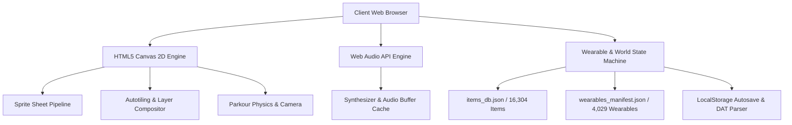

# 🌐 Growtopia Explorer & World Planner Studio

<div align="center">

**A high-performance, feature-rich web suite for Growtopia asset exploration, avatar set planning, and 2D world map building with live physics simulation.**

<br>

<a href="https://growtopia-explorer.vercel.app">
  
</a>

<br>

<!-- github-showcase:start -->
### Tutorial demo

<a href="https://growtopia-explorer.vercel.app">
  
</a>

<sub><strong>Explore → Inspect → Style → Build → Play</strong> · guided browser demo · 20 seconds · 1280×720</sub>

<br>

### Feature highlights

<a href="https://growtopia-explorer.vercel.app">
  
</a>

<sub><strong>World building → Physics → Interaction → Hazards → Moderator mode</strong> · edited showcase · 30 FPS · 1280×720</sub>
<!-- github-showcase:end -->

### **[🚀 OPEN THE LIVE PROJECT → growtopia-explorer.vercel.app](https://growtopia-explorer.vercel.app)**

> No setup required. Runs directly in the browser.

[](https://growtopia-explorer.vercel.app)
[](https://instagram.com/aryhaan)
[](#tech-stack)
[](#tech-stack)
[](#tech-stack)
[](#testing)
[](https://growtopia-explorer.vercel.app)
[](#features)

[🌐 Live App](https://growtopia-explorer.vercel.app) • [📸 Instagram @aryhaan](https://instagram.com/aryhaan) • [✨ Live Features](#-key-features) • [🚀 Quick Start](#-quick-start--local-development) • [🛠️ Tech Stack](#%EF%B8%8F-technology-stack--architecture) • [📖 Documentation](#-project-structure)

</div>

---

## 🌟 Overview

**Growtopia Explorer** is an all-in-one web-based workstation crafted for Growtopia creators, world designers, and pixel artists. It features a complete database of **16,304 items**, interactive sprite extraction, a full 3-pane **Avatar Set Planner Studio** with real-time sequence animation playback, and a full-fledged **2D World Planner** equipped with authentic autotiling connections, cross-compatible `.dat` map parsing, and a live **Parkour Physics Simulator with Moderator Noclip Mode**.

Built with **100% Vanilla JavaScript** and native web APIs including HTML5 Canvas 2D and Web Audio API, the application runs with zero heavy frontend framework dependency.

**Try it first:** [growtopia-explorer.vercel.app](https://growtopia-explorer.vercel.app)

---

## ✨ Key Features

### 1. 🔍 Item Sprite & Asset Explorer
- **Complete Item Database** with **16,304+ items** extracted from Proton `items.dat` v26 and `.rttex` tilesheets.
- Fast real-time search by item name, numeric ID, action type, and category.
- Interactive high-resolution pixel-perfect sprite previews and metadata.
- Animation sequence preview with configurable frame count and playback speed.
- Export single PNG sprites, animated GIFs, or individual animation frames.

### 2. 🧍 GT Set Planner / Avatar Studio
- **4,029+ categorized wearables** across hats, shirts, pants, shoes, wings, face, hand items, artifacts, and more.
- Live multi-layer character rendering with skin-tone tinting and facial expressions.
- Layer hierarchy and X/Y offset fine-tuning.
- Animated wearable sequence playback.
- Export PNG, layered ZIP, and animated GIF loops.

### 3. 🌍 GT World Planner & Map Builder
- Interactive 2D tile canvas with zooming and panning.
- Smart autotiling for connectable furniture, fences, pipes, ropes, terrain, and more.
- Selection, Copy, Cut, Paste, Mirror, Bucket Fill, and Clear tools.
- **68 weather backdrops**.
- Custom world dimensions from compact maps up to large 200×200 layouts.
- Import/export Growtopia `.dat` world files and JSON save states.
- High-resolution PNG rendering for selections or full worlds.

### 4. 🎮 Parkour Physics Simulator & Moderator Mode
- Live playable platformer physics for testing parkour maps.
- Jump, double-jump, drop-through platforms, collision, hazards, and respawn logic.
- Moderator mode with 8-way flight and noclip.
- Placement bounce and particle effects.

### 5. 🎵 Music Sheet Web Audio Sequencer
- Web Audio API playback for Growtopia music sheet tiles.
- Moving playhead, configurable BPM, and looping.

### 6. 🔊 Audio & Sound Effects Library
- Searchable sound library with hundreds of `.wav` and `.ogg` assets.

---

## 🛠️ Technology Stack & Architecture



- **Frontend Core**: ES6+ Vanilla JavaScript.
- **Rendering**: HTML5 Canvas 2D with pixel-art-friendly rendering.
- **Audio Processing**: Web Audio API with decoded buffer caching and scheduled playback.
- **State Persistence**: Browser `localStorage` with compressed world autosaves.
- **Deployment**: Vercel static hosting and CDN delivery.

---

## 📁 Project Structure

```text
growtopia-explorer/
├── public/
│   ├── index.html
│   ├── world.html
│   ├── app.js
│   ├── world_planner.js
│   ├── world_catalog.js
│   ├── wearable_catalog.js
│   ├── wearable_sequence.js
│   ├── avatar_positioning.js
│   ├── avatar_tint.js
│   ├── avatar_layer_exporter.js
│   ├── gifencoder.js
│   ├── styles.css
│   ├── items_db.json
│   ├── wearables_manifest.json
│   ├── tilesheets_info.json
│   ├── audio_db.json
│   ├── tilesheets/
│   ├── weather/
│   └── audio/
├── tests/
├── docs/
│   └── live-demo.svg
├── vercel.json
├── .gitignore
└── README.md
```

---

## 🚀 Quick Start & Local Development

### Fastest option

Just open the hosted version:

### **[→ Launch Growtopia Explorer](https://growtopia-explorer.vercel.app)**

### Run locally

```bash
git clone https://github.com/araeys/growtopia-explorer.git
cd growtopia-explorer
python -m http.server 5000 --directory public
```

Then open:

- Item Explorer & Avatar Studio: `http://localhost:5000/`
- World Planner & Parkour Mode: `http://localhost:5000/world.html`

You can also use Node.js:

```bash
npx serve public -p 5000
```

---

## 🧪 Testing

```bash
python -m unittest discover -s tests -p "test_*.py"
node --test tests/*.test.js
```

**Test Results:** `137 / 137 Tests Passing`

---

## 🌐 Deployment

The production build is live at:

### **https://growtopia-explorer.vercel.app**

The repository also contains `vercel.json` for Vercel deployment configuration.

---

## 👨‍💻 Author & Credits

- **Creator / Developer**: **Raey** ([@araeys](https://github.com/araeys))
- **Instagram**: **[@aryhaan](https://instagram.com/aryhaan)**
- **Assets & IP**: Growtopia assets and sprites are properties of Ubisoft / Robinson Technologies. This project is created for educational, design, and non-commercial community purposes.

---

<div align="center">
  <strong><a href="https://growtopia-explorer.vercel.app">🌐 OPEN THE LIVE PROJECT</a></strong><br><br>
  <a href="https://instagram.com/aryhaan"></a><br><br>
  <sub>Built with pure Vanilla JavaScript by @araeys · Instagram @aryhaan</sub>
</div>
